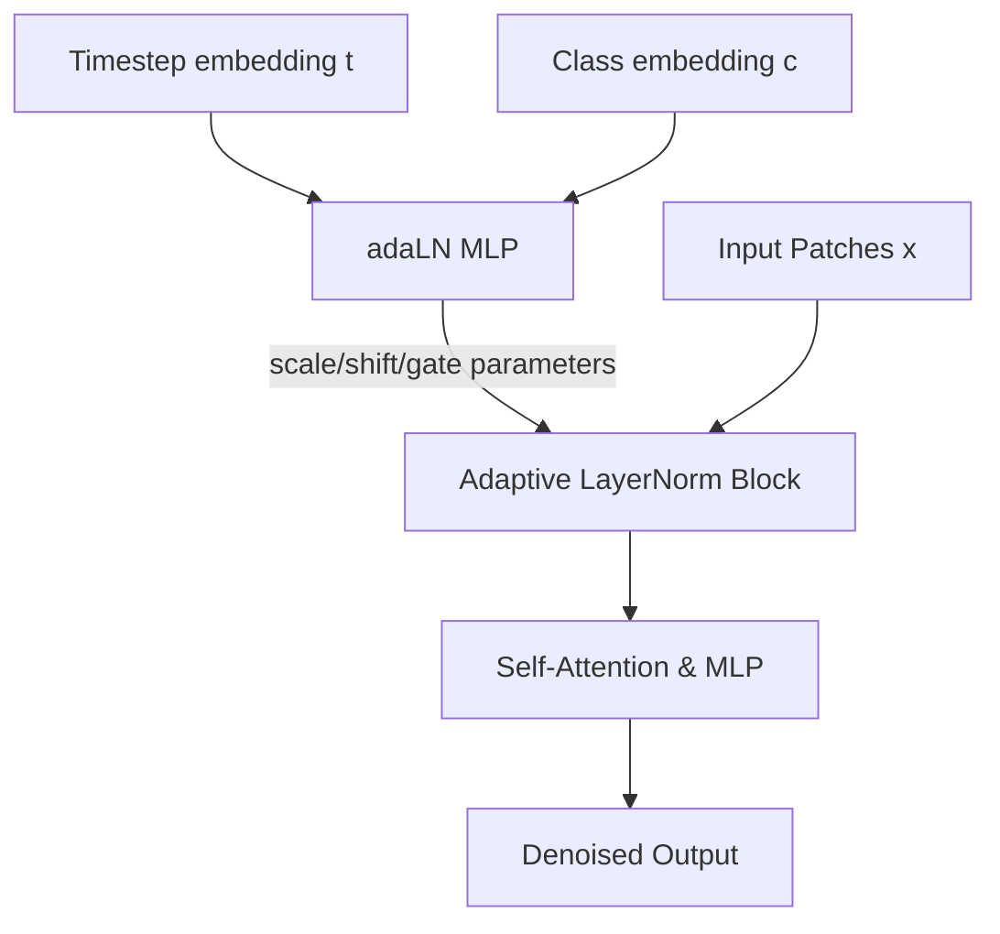

# Adaptive LayerNorm (adaLN-Zero) DiT

## Overview
Regarded as the standard architecture standard (e.g., DiT-XL/2). Instead of feeding conditions as tokens, it uses a multi-layer perceptron (MLP) to dynamically regress scaling and shifting vectors applied to LayerNorm blocks.

## Detailed Information
Adaptive LayerNorm (adaLN-Zero) is a cornerstone of the DiT architecture. Instead of treating conditions as extra tokens, it regresses scaling and shift parameters for LayerNorm from the timestep and class embeddings. In adaLN-Zero, the network is initialized such that residual blocks output zero initially (via dimension-wise scaling factors initialized to zero), which facilitates training stability by starting as an identity mapping.

## Architecture & Data Flow

---
[← Back to README](../README.md)
