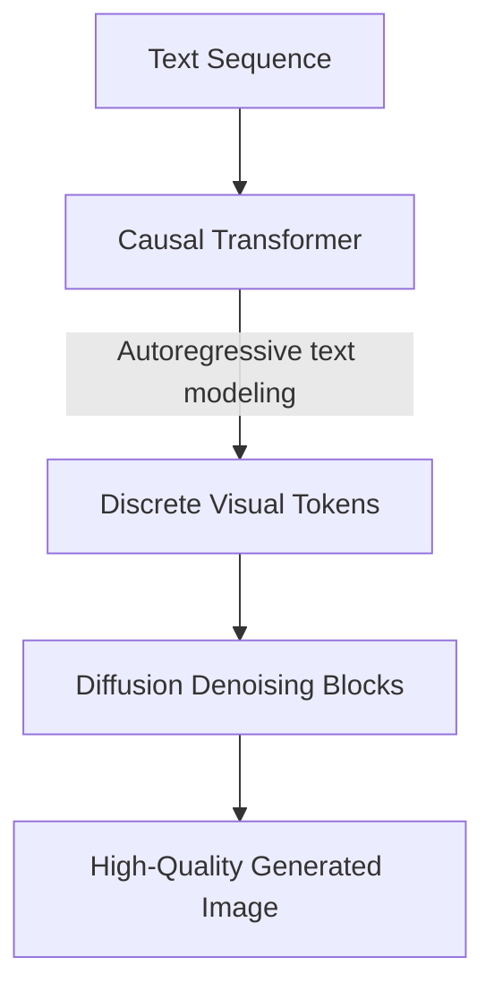

# Autoregressive-Diffusion Hybrids (Discrete DiT)

## Overview
Uses a single, unified causal transformer backbone that switches modes: autoregressively processing text syntax before applying diffusion denoising algorithms on codebook visual tokens.

## Detailed Information
Discrete DiT hybrids (such as Show-o) combine the sequential understanding capabilities of autoregressive models with the iterative refining strengths of diffusion models. The model tokenizes text and images into discrete codebooks, using a causal transformer to handle multimodal context autoregressively and a non-causal visual token denoising process for generation.

## Architecture & Data Flow

---
[← Back to README](../README.md)
