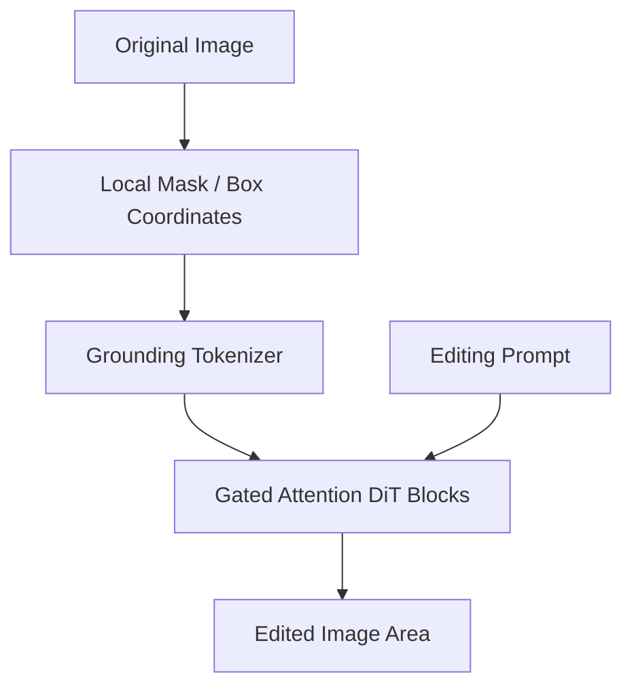

# Controllable Media Editing & Inpainting

## Overview
Seamlessly maps bounding box dimensions or localized pixel coordinates into specific sequence tokens, executing pinpoint image modifications or structural background extensions while keeping unedited frames consistent.

## Detailed Information
Controllable editing tools (such as GLIGEN or OminiControl) map bounding boxes, masks, or control points directly into location-aware sequence tokens. These are fed to the diffusion transformer using gated or specialized attention layers, letting users edit precise regions of an image while preserving the global context.

## Architecture & Data Flow

---
[← Back to README](../README.md)
