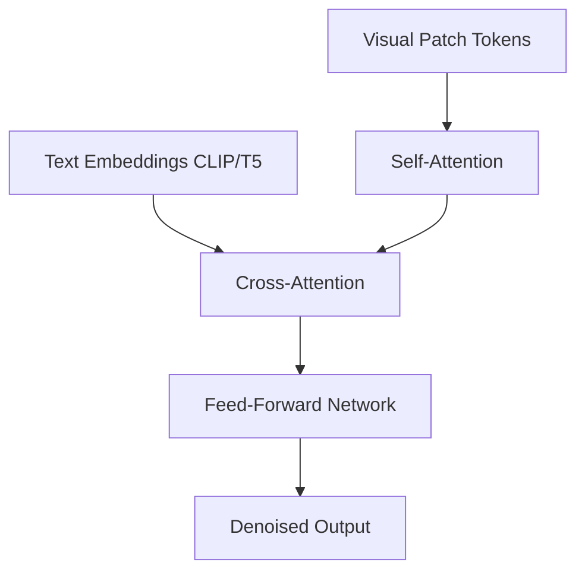

# Cross-Attention Conditioning DiT

## Overview
Embeds distinct Multi-Head Cross-Attention layers inside the transformer block, mapping text embeddings from a separate encoder (like T5 or CLIP).

## Detailed Information
Cross-Attention Conditioning inserts dedicated multi-head cross-attention layers into the DiT block. The queries ($Q$) come from the visual patch tokens, while the keys ($K$) and values ($V$) come from external text embeddings (e.g., from CLIP or T5). This allows fine-grained token-to-pixel prompt alignment, crucial for text-to-image foundation models.

## Architecture & Data Flow

---
[← Back to README](../README.md)
