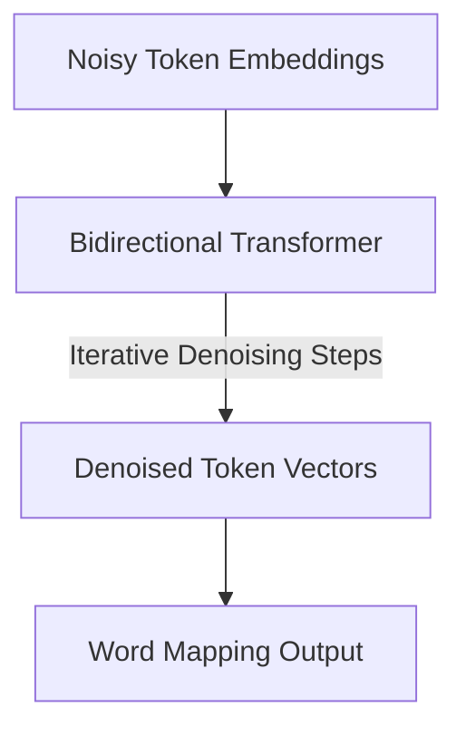

# Diffusion Language Models (Diffusion LLMs)

## Overview
Drops causal sequence generation entirely. Instead, it initiates text production from an entirely masked or noisy multi-token string sequence, iteratively refining and unmasking words simultaneously using a bidirectional transformer.

## Detailed Information
Diffusion LLMs represent a departure from standard left-to-right autoregressive text generation. They initialize generation from continuous noisy embeddings representing a full sequence. Over several steps, the model iteratively denoises these continuous vectors, transitioning them back to discrete text tokens. This approach supports powerful gradient-guided controllable text generation.

## Architecture & Data Flow

---
[← Back to README](../README.md)
