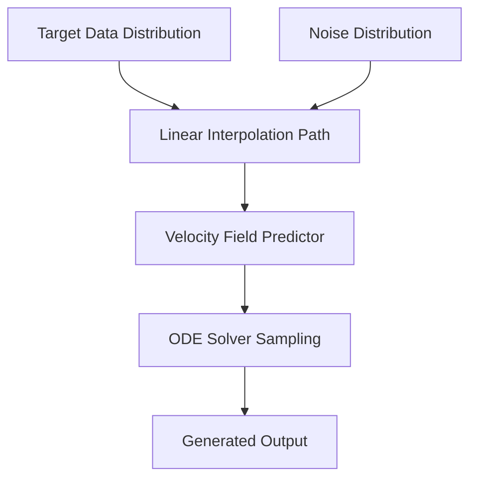

# Flow Matching / Rectified Flow Transformers (SiT)

## Overview
Replaces traditional curved Gaussian denoising pathways with linear, straight ordinary differential equation (ODE) vector trajectories (e.g., Scalable Interpolant Transformers).

## Detailed Information
Flow Matching and Rectified Flow models simplify diffusion mathematics by defining a straight path between noise and target data. Rather than modeling curved drift/diffusion coefficients, these models train the transformer to predict a velocity field that guides a straight-line trajectory, drastically speeding up sampling and requiring fewer steps.

## Architecture & Data Flow

---
[← Back to README](../README.md)
