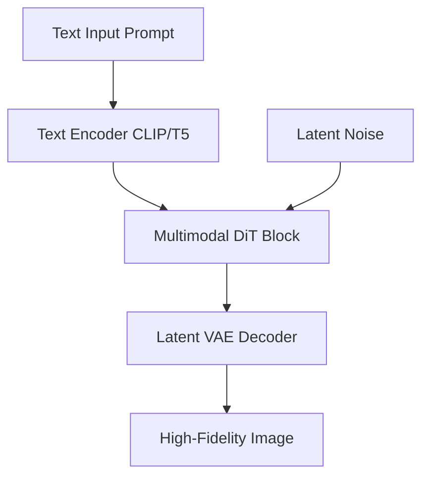

# High-Fidelity Text-to-Image Synthesis

## Overview
Powers consumer systems (like Stable Diffusion 3 / 3.5 Large) to generate dense, compositionally accurate images and cleanly render textual layout lettering on demand.

## Detailed Information
High-fidelity text-to-image synthesis models (like SD3) rely heavily on Multimodal Diffusion Transformers (MMDiT). By mapping text and visual representations into a joint transformer space, the system generates complex layouts, handles complex text prompts, and renders readable, clean typography directly within the image.

## Architecture & Data Flow

---
[← Back to README](../README.md)
