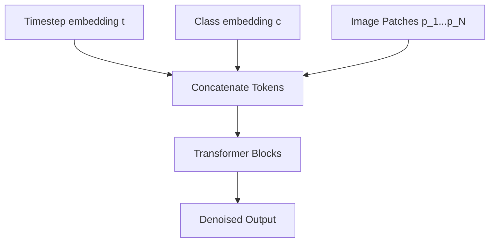

# In-Context Conditioning DiT

## Overview
Concatenates conditioning vectors (like time-step and class embeddings) directly to the sequence of input patch tokens as an extended prefix.

## Detailed Information
In-Context Conditioning is the simplest way of conditioning a Vision Transformer for diffusion tasks. By prepending conditioning tokens (like the time embedding and class labels) to the visual sequence tokens, the standard self-attention mechanism learns to attend to these conditioning inputs. However, this increases the sequence length processed by self-attention, leading to quadratic computation overhead with respect to sequence length.

## Architecture & Data Flow

---
[← Back to README](../README.md)
