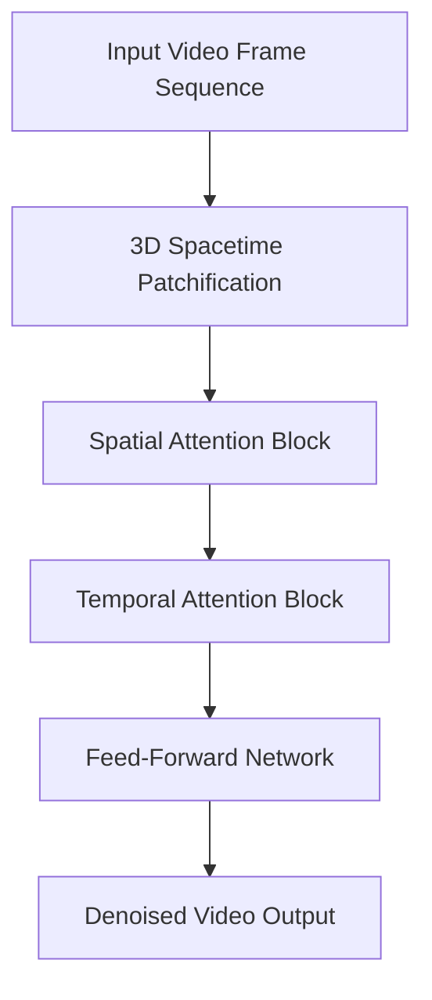

# Spatio-Temporal Video Transformers (3D DiT)

## Overview
Tokenizes video inputs into 3D spacetime cubes or interleaves 2D spatial attention with 1D temporal axial attention layers.

## Detailed Information
3D DiT architectures extend the patchification concept of image-based Vision Transformers to the temporal domain. Video volumes are decomposed into spacetime cubes (patches with spatial height, width, and temporal depth) or processed via interleaved spatial and temporal attention layers, capturing motion dynamics and ensuring temporal consistency across frames.

## Architecture & Data Flow

---
[← Back to README](../README.md)
