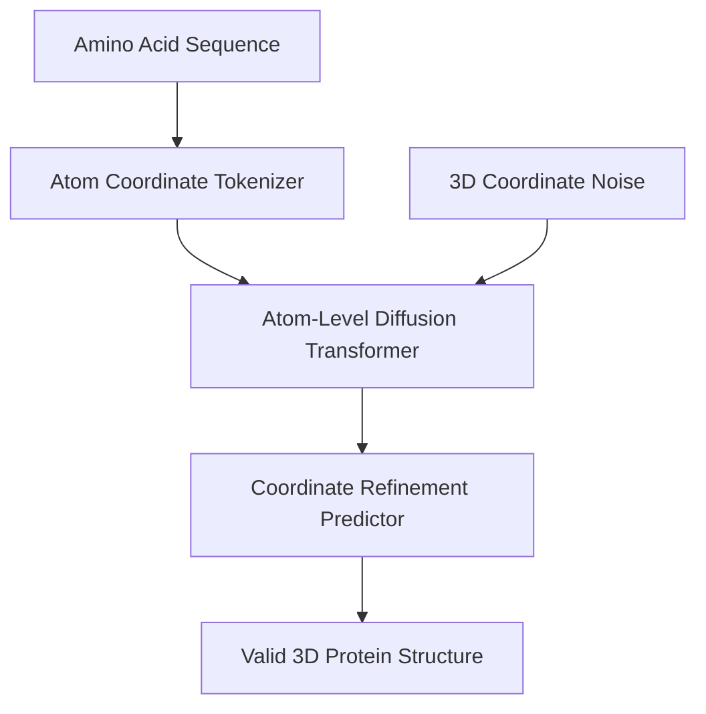

# Structural Material & De Novo Drug Discovery

## Overview
Applied to all-atom molecular structures. Reinterprets amino acid sequences or atom geometric coordinates as sequential patch tokens, predicting physical coordinate refinements to synthesize entirely novel proteins.

## Detailed Information
AlphaFold 3 and similar structural generative models utilize a variant of diffusion transformers to predict the 3D coordinates of all atoms in a protein-ligand system. Instead of generating pixels, the model operates on physical token nodes, iteratively predicting refinements of spatial coordinates to discover stable, novel biomolecules.

## Architecture & Data Flow

---
[← Back to README](../README.md)
