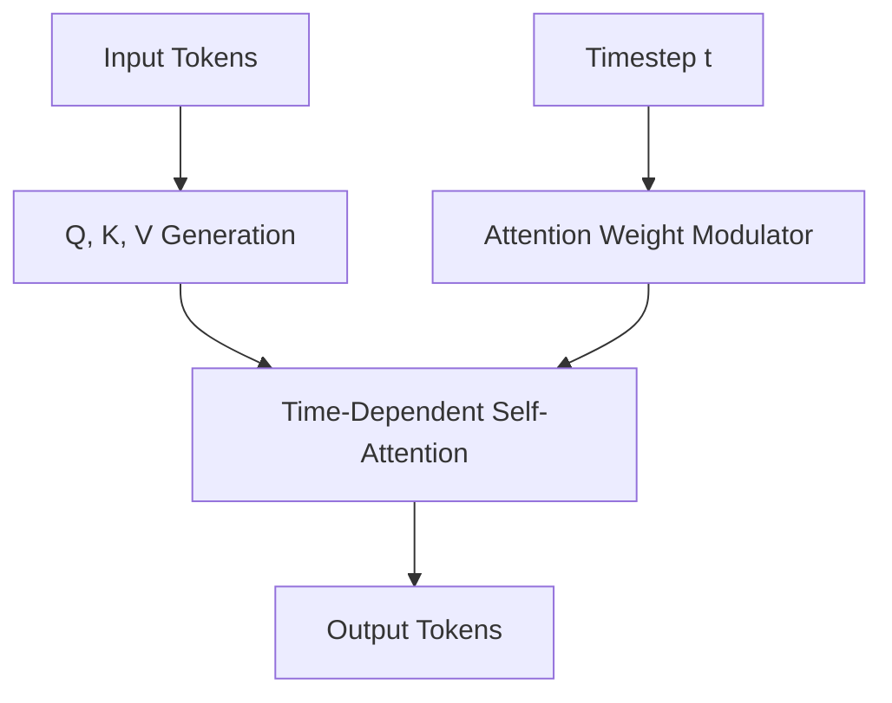

# Time-Dependent Multihead Self-Attention (DiffiT)

## Overview
Employs specialized attention weights that dynamically shift behavior depending on whether the current diffusion step is at high-noise initialization or low-noise detail crisping.

## Detailed Information
DiffiT adapts the internal multihead self-attention module to be time-dependent. Since a diffusion model behaves differently at early timesteps (forming coarse global structures) compared to late timesteps (refining high-frequency details), DiffiT dynamically shifts attention behaviors using parameterized time-dependent gating weights.

## Architecture & Data Flow

---
[← Back to README](../README.md)
